<p align="center">
  
</p>


### Tutorial Aims & Steps:

#### <a href = "#ggplotly"> 1. Discover some functions of `ggplotly` </a>

#### <a href = "#modify"> 2. Modifying your `ggplotly` </a>

#### <a href = "#plot_ly"> 3. Introduction to `plot_ly` </a>

#### <a href = "#saving"> 4. Saving your interactive graphs </a>

#### <a href = "#challenge"> 5. Challenge yourself! </a>


__The aim of this tutorial is to get you started on creating interactive graphs using the `plotly` package__

---------------------------

This tutorial is for those of you are are already familiar with the basics of static data visualisation and are ready to venture into the exciting new world of interactive grapgs! It will explain how to create basic interactive graphs using the R package `plotly` by exploring population changes in some mythical creature populations.

#### All the files you need to complete this tutorial can be downloaded from [this repository](https://github.com/EdDataScienceEES/tutorial-Mdzack). Click on `Clone/Download/Download ZIP` and unzip the folder, or clone the repository to your own GitHub account.

Interactive graphs are a great tool to get your reader to engage directly with the your data outputs.  By adding an interactive feature, you can add even more functionality to your graphs and really maintina your readers attention.  It also allows readers to extract the data they want from your results in an easily readable way!

 As with any other type of graph, it is important to choose the correct type of plot to properly display your data and message.  Before embarking on the journey to make your graphs interactive, you should first look over what makes a good graph. (More information on how to make clean and informative graphs can be found in into to data visualization tutorials [part 1](https://ourcodingclub.github.io/2017/01/29/datavis.html) and [part 2](https://ourcodingclub.github.io/2017/03/29/data-vis-2.html).  You should also make sure that the interactive function has serves function for your reader or purpose in visulizing your data, just as with any other graphical feature.

There are several packages which interact with various JavaScript data visualisation libraries that are particularly useful in producing interactive graphs such as `highcharter`, `leaflet`, and `rbokeh`.  Today, we will just be looking at the Javascript `plotly`! `plotly` is a free and open source R graphing library that 

Make a new script by clicking `File/New File/R Script`, give it an informative title and we can get started in creating or graphs!

<a name = "ggplotly"></a>

### 1. Creating a interactive graphs with ggplotly

_Reseasearch Question:_ Have there been changes in the native and invasive populations between 1990 and 2019?

Today we will be working with data on invasive species! We have noticed a big issue in the last few decades of some invasive species moving into California...dragons, mermaids, and unicorns! Our goal is to talk to show much these invasive populations have increased in recent year and how they might have affected our native populations: fairies, pegasuses, and phoenixes.

First, let's load our data and libraries

``` r
# Load Libaries ----
library(ggplot2)
library(plotly)
library(htmlwidgets)
library(tidyverse)
library(magrittr)

# Load Data ----
sp_data <- read.csv("Data/Invasive_Species.csv")


````

`Plotly` is unique in the suite of plotting packages because you can just add it on to the end of your ggplot!  This can be done using the `plotly` function `ggplotly()`. 

The `ggplot2` package. `ggplot2` is a graphing package which allows users to easily add layers of arugments into the function to create informative and visually appealing graphs.  If you are unfamiliar with `ggplot2 ` I would highly recommend completing the [Data Visualisation](https://ourcodingclub.github.io/2017/01/29/datavis.html) and [Data Visualisation 2](https://ourcodingclub.github.io/2017/03/29/data-vis-2.html) Coding Club tutorials to learn how to use the package.

First, you can download the package through Cran by running the code below.

``` r
install.packages("plotly")

```

Now, let's explore this `ggplotly` by graphing how our species are changing over time by creating a line plots of our species using the `ggplot()` in the `ggplot2` package!

__Note:__ All of the graphing code chunks are wrapped in paratheses.  This is because were are also saving them as objects using the `<-`, so if they were not wrapped in `( )` they would not automatically appear in the plotting window.


``` r
# Using ggplot to graph invasive species plot over time
(myth_trend <- (ggplot(sp_data, aes(x = year, y = (population), fill = species)) +
               geom_line(aes(colour = species)) +
               labs (title = "Invasive and Native Population Dynamics Between 1990 and 2019",
                     x = "\n Year", y = "Population (count)") +
               theme_bw() + 
               theme(legend.position = "bottom",
                           panel.grid = element_blank(),
                           plot.subtitle = element_text(size = 13, face = "bold"),
                           legend.box.background = element_rect()) + 
                     scale_x_continuous(breaks = scales::pretty_breaks(n = 10)) +
                     scale_y_continuous(breaks = scales::pretty_breaks(n = 10)) +
                    ggsave(filename = "Graphs/myth_trend.png", device = "png", width = 6, height = 5, units = c("in"))))

```

It should look something like this:

<p align="center">
	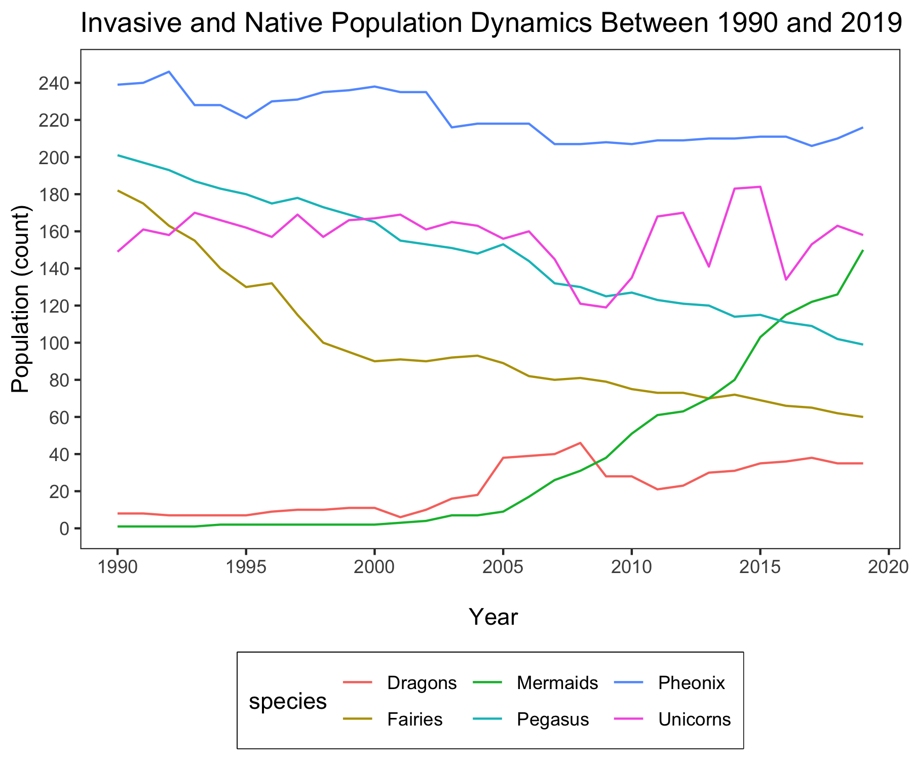
</p>


The `ggplotly` fucntion is great to allow readers to get specific numeric informtion tehy want out of your graphs without making your graph too messy with too many data labels.  For instance, if a reader wanted to know the exact year or population number in your graph, they could find it. Plus, if you're only looking for simple interactivity, you don't have to learn much new coding syntax if you're already familiar with `ggplot2`!

Now, to create our interactive plot all you have to do is run the name of the plot inside the function `ggplotly()`.

``` r
(trend_ggplotly <- ggplotly(myth_trend))

```

<p align="center">
	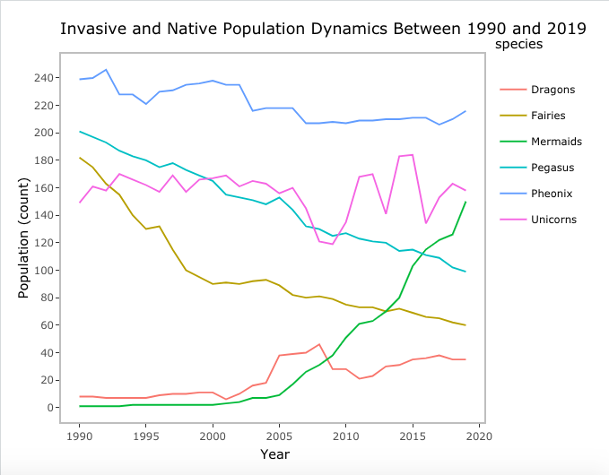
</p>

<a href="https://plot.ly/~Kaja898/1/#/">Click here for graph</a>

You should see a plot very similar to our first graph appear in the plot tab, although it might notice a few new things when you move your mouse over the plot window.  See how you can see the information for each point as you scroll your mouse over it.

There's also a lot of new things that have appeared in the plotting window. Look at the legend, if you click on the line or point you can remove that species from the graph.  This funcionality allows the reader to visually compare whatever datasets they choose.  

Try picking displaying only our invasive species: dragons, mermaids, and unicorns.
<p align="center">
	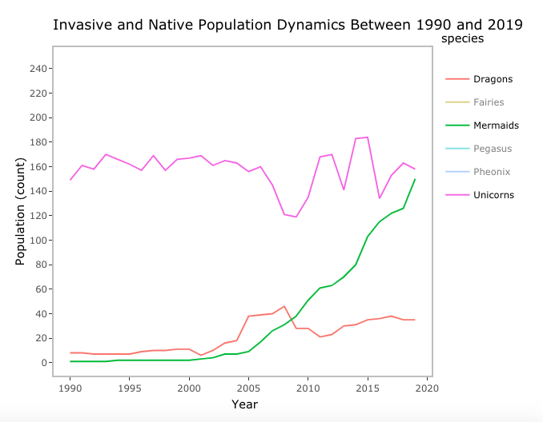
</p>

Now, try only our native, fairies, pegasuses, and pheonixes.
<p align="center">
	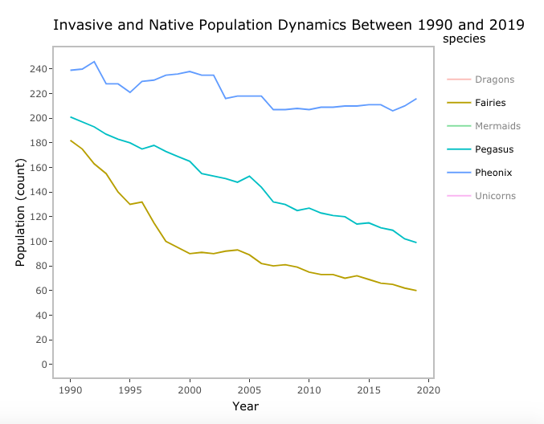
</p>


Let's explore the toolbar on the upper right hand corner of the plot window.

<br><br>

<p align="center">
	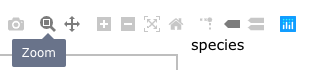 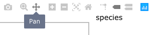
</p>

<br><br>

<p align="center">
	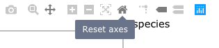 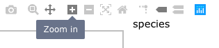
</p>

<br><br>

<p align="center">
	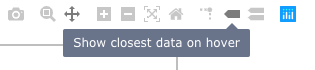 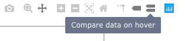
</p>

<br><br>

<p align="center">
	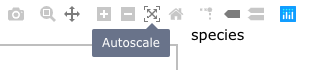
</p>

The "zoom" allow you to zoom in on your graph to specific datasets, while the "pan" let's you shift around the graph while you're zoomed in.  The "reset axes" and "autoscale" center and zoom the graph out.  The "compare data on hover" brings up information for every point on the y-axis for every x-axis point you scroll through.

<a name = "modify"></a>

### 2. Modifying your `ggplotly`

Beyond our basic ggplot graph, `plotly` allows us to modify the interactive functions inside he `ggplotly()` fucntion.  For instance, you to choose what information you want to display for each point, and in what order.  The default for `ggplotly` is to display x, y, and categorial data.  You can modify this in the "tooltip" argument of the function:

``` r
# Modify the plot to show only population count for a point
(trend_ggplotly2 <- ggplotly(myth_trend, tooltip = c("y")))

```

<a href="https://plot.ly/~Kaja898/3/">Click here for graph</a>

<p align="center">
	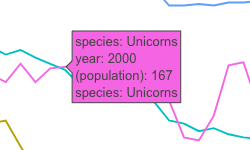 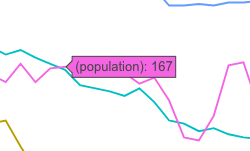
</p>

See how the box that appears over each point looked like what appears in the left picture above, while the new box looks like the picture on the left.

We can also add more interactive features by adding the `layout()` layer using a pipe operator.  The pipe operator, or `%>%`, is property of the `magrittr` package and is comomonly used to do efficient data manipulation the `tidyverse`.  However, it can also be used with `plotly` to pass one function to another. (To learn more about pipes and how they are used in data manipulation I would recommend checking out our [efficient data manpulation](https://ourcodingclub.github.io/2017/01/06/data-manip-efficient.html#pipes) tutorial)  If you are familiar with `ggplot2`, it acts similarly to the `+` to craete additive layers and specialize your graphs. 

Inside the `layout()` function you can style the hover labels, change the click and drag function, add dropdowns, add, rangesliders, and add sliders.

Before, we changed the hover box to only include out y-values.  However, you might notice that the formatting still does not look fantastic.  We can actually change the specific text inside hover box in side `layout():

``` r
# Modify the plot to show only population count for a point
(slider_ggplotly <- ggplotly(myth_trend, tooltip = c("y")) %>% 
  layout(
    xaxis = list(
      title = "Year",                       # Adding back x-axis title
      rangeslider = list(type = "Year"))))    # adding rangeslider to graph

```

<p align="center">
	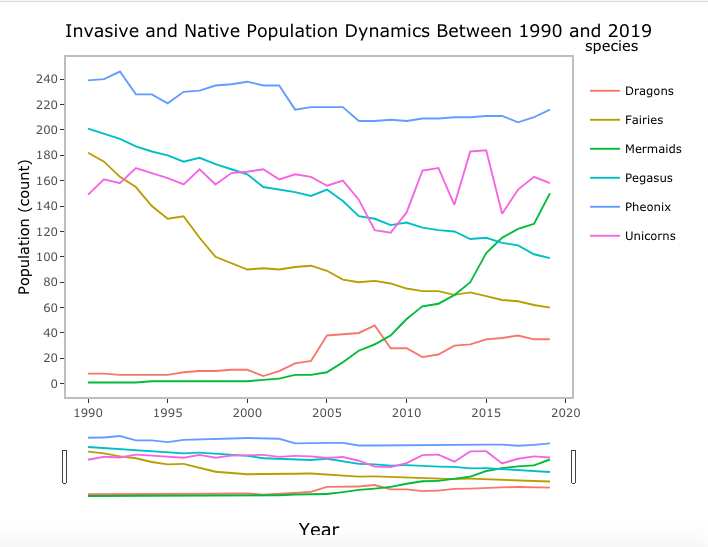
</p>

<a href="https://plot.ly/~Kaja898/9/">Click here for graph</a>


You should see as long bar that looks like your graph has been added to the bottom of the screen, that's the rangeslider! In the code, you can see that the rangeslider feature is nested within the x-axis line.  This is because we wanted to make a slider of x-axis values along the x-axis.  You may als notice the work `list()` appearing a lot.  `list()` is used in `plotly` syntax whenever you are going to nest one arugment inside another.  See how `list()` precedes both the x-axis title and `rangeslider` arugments.

The `style()` funciton acts similarly to `layout()`. It is added on by the pipe operator to change the color, hover boxes, and markers/lines. Let's add change the color of our hover boxes to a pale lavender color with dark purple font just for fun:

``` r
(color_ggplotly <- ggplotly(myth_trend, tooltip = "y") %>% 
    layout(
      xaxis = list(
        title = "Year",                       # Adding back x-axis title
        rangeslider = list(type = "Year"))) %>%     # adding rangeslider to graph
    style( 
      hoverlabel = list(            
        bgcolor = "#D5CCFF",            # designate color for hover label
        font = list(                
          color = "#6B088F"))))         # designate colo for font of hovel label

```
<a href=https://plot.ly/~Kaja898/11/#/">Click here for graph</a>

Your new hover labels should look something like this:

<p align="center">
	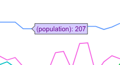
</p>


<a name = "plot_ly"></a>

### 3. Introduction to `plot_ly` 

`ggplotly` is a great function for creating interactive graphs from pre-existing ggplots, however, it is limited.  Here's where the `plot_ly` function comes in.   `plot_ly` gives you much more functionality in creating specialised buttons, slider, and dropdowns. 

`plot_ly` does require a little more learning, you can't just tack it onto the end of a `ggplot`.  `plot_ly` is similar to packages like `dplyr` and `ggplot` in that you can add layered arguments together into an easily readible structure.  It uses the ` %>% ` pipe operator from the `magrittr` package like the `tidyverse`.  

Plotly has even created a helpful cheatsheet ( [here](https://images.plot.ly/plotly-documentation/images/r_cheat_sheet.pdf?_ga=2.171393568.1848821827.1574615382-1352645038.1572958211)) that's a great reference guide when getting started! 


Before adding extra functions, let's recreate the line plot we made in `ggplot`in `plot_ly` syntax.

``` r
myth_plotly <- plot_ly(sp_wide, x = ~year,
        y = ~Dragons, 
        type = "scatter", 
        mode = "lines",
        hovertemplate = paste("Population: %{y}"),
        name = "Dragons") %>%
  add_trace(y = ~Fairies, name = "Fairies") %>%     # for plotly, you need to make new trace for every line you want to add 
  add_trace(y = ~Mermaids, name = "Mermaids") %>%
  add_trace(y = ~Pegasus, name = "Pegasus") %>%
  add_trace(y = ~Pheonix, name = "Pheonix") %>% 
  add_trace(y = ~Unicorns, name = "Unicorns") %>% 
  layout( title = "Invasive and Native Population Dynamics Between 1990 and 2019", # add title 
          xaxis = list(title = "Year"),   # name x-axis
          yaxis = list(title = "Population (count)")) 
                
```
<p align="center">
	
</p>

<a href="https://chart-studio.plot.ly/~Kaja898/5">Click here for graph</a>

The `plot_ly` function uses the `%>%` pipe function to add layers beyond the basic `plot_ly()` line of code.  Similarly to `ggplot2`, you can add axis labels, titles, etc. by adding lines with the ` %>%` like you would with `+`.  Every layer has an arugment 


### Figure hierarchy


### 4. Saving and embedding your interactive graphs 

#### Saving with `htmlwidgets` and API
`Plotly` is an interactive web graphic, so all the graphs are automatically produced as HTML in the `htmlwidgets` framework.  Our `ggplot2` graphs which can be saved using the `ggsave` function and normal plots which are saved by bookending your plot with using `png("filename.png")` and `dev.off()`, for example.  However. `plot_ly` and `ggplotly` graphs have to be saved in a special way using `htmlwidgets` to save.

Let's save the first graph we made using `htmlwidgets`
``` r
# Assign the ggplotly as an object
trend_ineractive <- ggplotly(myth_trend, tooltip = "y")

# Save the graph using htmlwidget
htmlwidgets::saveWidget(trend_ineractive, "trend_ineractive.html")

```
Running the code chunk above will save the `plotly` graph as an `html` file locally on your device.  This means that you will be able access it from your computer and your Github, once the file is pushed.  However, when `plotly` graphs are pushed to Github they lose their interactive function and appear only as chunks of raw `html` code.  However, another great function of `plotly` is that you can publish your graphs to an individualised profile on the `plotly` website.  By publishing, you can easily share your graphs with others and even edit online!


#### Embedding your graphs 


<a name = "challenge"></a>

### 5. Challenge yourself!

Create a barplot of the population counts with a sliding bar for years 

### Goals 
- Understand the benefits of creating interactive graphs 
- 


<hr>
<hr>

#### Check out our <a href="https://ourcodingclub.github.io/links/" target="_blank">Useful links</a> page where you can find loads of guides and cheatsheets.

#### If you have any questions about completing this tutorial, please contact us on ourcodingclub@gmail.com

#### <a href="INSERT_SURVEY_LINK" target="_blank">We would love to hear your feedback on the tutorial, whether you did it in the classroom or online!</a>

<ul class="social-icons">
	<li>
		<h3>
			<a href="https://twitter.com/our_codingclub" target="_blank">&nbsp;Follow our coding adventures on Twitter! <i class="fa fa-twitter"></i></a>
		</h3>
	</li>
</ul>

### &nbsp;&nbsp;Subscribe to our mailing list:
<div class="container">
	<div class="block">
        <!-- subscribe form start -->
		<div class="form-group">
			<form action="https://getsimpleform.com/messages?form_api_token=de1ba2f2f947822946fb6e835437ec78" method="post">
			<div class="form-group">
				<input type='text' class="form-control" name='Email' placeholder="Email" required/>
			</div>
			<div>
                        	<button class="btn btn-default" type='submit'>Subscribe</button>
                    	</div>
                	</form>
		</div>
	</div>
</div>


